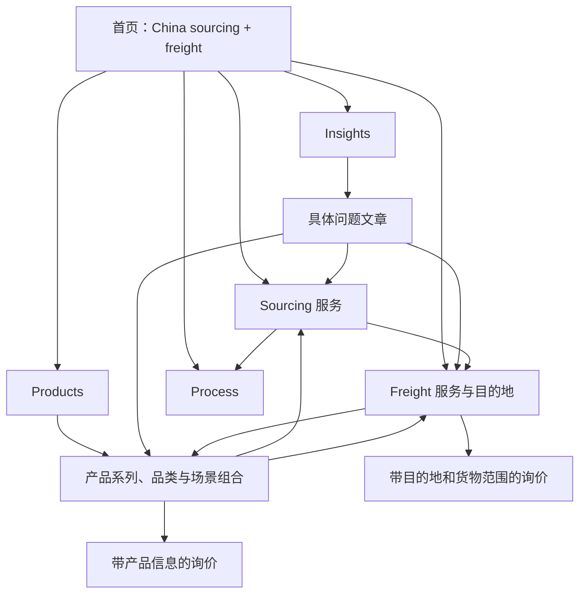

# DDNZ 全站搜索承接与整合报告

日期：2026-09-23。范围：本地最新候选网站；尚未推送或发布线上。对应整合任务：改版｜中亚运输多国运输。

本轮把采购和国际货运作为同一条客户旅程整理：寻找产品与供应商 → 比较配置和报价 → 样品与验货 → 集货与出口交接 → 国际运输。每个页面承担其中一个主要决策，相关页面通过具体链接连接。目标是扩大有用、可抓取的搜索覆盖；不能用候选词数量推断搜索量或排名增长。

## 已经落到网站的内容

- 保留并整合中亚区域总览、区域与目的国页面、空运/FBA/仓储服务、真实轮毂装载材料、尼日利亚市场参考，以及 15 个中国货源地×货类×目的地场景。15 个场景有英文、中文、西班牙文；市场参考图不冒充交付案例。
- 保留伟基业食品加工机械的 11 个英文页面：1 个产品系列、4 个品类、6 个场景组合；16 款设备价格沿用指定 PDF 的批发价口径。
- 保留此前 99 个运输页面语言版本的静态正文修复。本轮另将 26 个核心页面版本纳入正文预渲染：8 个首页、8 个 Insights、8 个 Process、英文 Products 和采购服务总览。首页静态版提供真实 Hero、采购货运衔接和 FAQ，并非所有延迟加载模块均已静态化。
- 首页及 Insights 的标题、主标题、介绍在 8 种语言下统一定位。首页明确 China sourcing + international freight forwarding；Insights 明确 sourcing and shipping guides。
- 新写 17 个英文买家决策问答：采购服务 4 个、Products 4 个、Process 4 个、Insights 5 个。答案有上下文和相关页面链接，浏览器与静态正文共同使用；本轮没有冒充已完成其他语言翻译。
- 修正首页产品卡片与葡语/土语运输链接的语言路由：存在作者翻译时进入翻译页，否则进入现有英文页。未建立的语言版本不再成为导航目标。普通产品页隐藏仅供评审使用的版本对照条。

## 页面各自承接什么

表中“核心/中尾/长尾”表示主题宽窄与搜索意图，不代表已经测得的高、中、低搜索频次。搜索量字段统一 unknown。

| 页面家族 | 核心主题与主页面 | 中尾主题 | 长尾决策与承接方式 |
|---|---|---|---|
| 首页 | China sourcing and international freight forwarding；`/` | China sourcing and shipping company | source, inspect and ship products from China；介绍责任分工，分流采购/已有订单/只需货运 |
| Sourcing 服务 | China sourcing services；`/sourcing-services/` | supplier search and verification、pre-shipment inspection、multi-supplier consolidation | compare supplier quotations with the same specification；各子页解释输入、输出、验收和交接 |
| Products 总览与系列 | products sourced from China；`/products/` | commercial kitchen equipment from China、wholesale phone cases from China、food processing machinery from China | 具体用途、型号、配置、MOQ、包装和询价范围；进入系列/品类/组合页，不全塞进总览 |
| Freight 服务与国家 | sea/air/LCL freight from China；各运输方式页 | shipping from China to Kazakhstan/Nigeria 等；区域总览用于比较目的地 | shipping food processing machinery from China to Kazakhstan；国家正文承接货类、包装、城市和交接，链接采购产品与运输询价 |
| Insights 与文章 | China sourcing and shipping guides；`/insights/` | supplier risk、dealer assortment、quote comparison | first kitchen equipment container for a Nigeria dealer；文章回答一个问题，再链接对应商品或服务 |
| Process | China sourcing process；`/how-we-work/` | sourcing inspection and consolidation workflow | when to approve samples、what happens after inspection differences、how supplier orders become shipping instructions；呈现具体决策顺序和证据 |

同一主题按客户目的分配，而不是把 buy/source/supplier/wholesale 的每种同义组合建成独立页。例如：

- **China sourcing agent** 的服务意图归采购服务总览；首页讲“采购+货运”的整体衔接。
- **warehouse consolidation in China** 归仓储服务，解决接货、批次、库存和装载准备；**multi-supplier order consolidation** 归采购集货服务，解决订单对齐、验货放行和商业单据交接。两页可以引用对方，但首段和服务输出应保持区别。
- **portable power stations from China** 由户外产品系列承接商业选品；电源选型工具讲负载与续航；经销商文章讲露营/停电备电的两档产品组合。
- **restaurant kitchen package** 讲整店菜单、空间与公用设施；**food processing package** 讲洗切、绞肉、面团等工序。食品加工组合不自动代表整套厨房、安装或冷库。
- **from Asia** 只在具有真实亚洲其他国家供应与交付能力、证据及内容时使用。当前主要中国采购能力不应被文案扩成泛亚洲供应承诺。

## 按全球客户的真实购买任务组织

| 客户 | 常见搜索/顾虑 | 最短页面路径 | 询盘需要的信息 |
|---|---|---|---|
| 第一次进口的中小企业 | buying from China、supplier verification、sourcing agent vs forwarder | Insights 问题 → 采购服务 → Process → 询价 | 产品、数量、样品、目的地、交付范围 |
| 批发商/经销商 | wholesale + 产品 + from China、first container、mixed assortment | 系列 → 品类/经销商方案 → 集货 → 国家运输 | SKU/型号与数量、复购要求、装箱与货好时间 |
| 餐饮经营者/承包商 | restaurant equipment package、menu/layout、utilities | 厨房组合 → 场景页 → 食品加工/冷藏品类 → 项目询价 | 菜单、场地、供电、产能与施工边界 |
| 已有供应商的买家 | inspect my supplier order、combine several orders | 验货/集货 → 仓储 → LCL/FCL → 目的国 | 供应商清单、订单、验收要求、释放决定 |
| 自有品牌或连锁店 | private label、MOQ、packaging、replenishment | 具体产品 → 自有品牌/门店页 → 质量控制 | 商标包装需求、型号分布、样品与补货计划 |
| 只需要运输的货主 | air/sea/LCL freight、cargo to destination | 运输方式或目的国 → 货物限制/单据 → 运输询价 | 货名、件数、尺寸毛重、提货地、收货范围 |

“全球”通过真实目的地、语言和用途覆盖。不能把各国名字机械组合成数千个几乎相同的页面；独立页需要能独立帮助买家决策的内容。Google 的帮助性内容与 doorway 指导支持这一原则：[帮助性内容](https://developers.google.com/search/docs/fundamentals/creating-helpful-content)、[Doorway pages](https://developers.google.com/search/blog/2015/03/an-update-on-doorway-pages)。

## 多语言分配与当前缺口

当前 sitemap 共 332 页：英文 102、西语 51、阿语 50、中文 36、俄语 36、法语 37、葡语 10、土语 10。这是实际页面数，不是每个语言拥有同样完整的产品目录。

- 英文：全球跨境交易的基线，产品、问答与指南最完整。
- 西语：围绕拉美买家的 compras/importar desde China、proveedores、consolidación、目的国运输组织。现有西语服务/运输内容优先链接已有西语产品内容。
- 阿语：围绕采购、批发、验货、从中国运输与集货；对已有海湾国家页面提供相应入口。
- 俄语：中亚与俄罗斯运输是现有入口；后续优先为有询盘的品类补完整产品页面，而不是只翻译标题。
- 法语：采购服务和现有西非路线承接；产品扩展先依据实际法语询盘。
- 葡语/土语：当前为有限基础页面。未提供的国家、区域、现代货运服务版本使用英文回退，不显示虚构翻译链接。
- 中文：便于供应链沟通与站点管理，但不以中文词覆盖代替目的地买家的母语购买表达。

西语“agente de compras en China”、俄语“доставка из Китая”、阿语“شحن من الصين”在当地服务商页面中能观察到实际用法；这只是术语验证，不能作为频次证据：[Chilat](https://www.chilat.com/h5)、[China-Line](https://china-line.ru/services/groupage-cargo-delivery)、[Silk Road](https://silkroadship.com/a-freight-consolidation-company-in-china/)。法语、葡语、土语的扩展词仍需母语审校和查询数据验证。

语言版本须有对应正文与准确链接；不将导航语言等同于文章语言。参考 [Google 多区域/多语言网站指导](https://developers.google.com/search/docs/advanced/crawling/managing-multi-regional-sites)。

## 内链与页面构建规则

每个页面建立一个主要主题，Title/H1/首段自然描述该主题，H2/正文讲买家所需的比较条件、限制和交接。产品页包含 buy/source/wholesale 与 China 的语义；资料文章围绕答案展开，不强求每段含商业词。站内链接使用“compare machinery models”“review multi-supplier consolidation”等具体锚文本，而非所有链接都叫 Learn more。参考 [Google 可抓取链接指导](https://developers.google.com/search/docs/crawling-indexing/links-crawlable)。

网站主导航和现有 URL 得以保留。本轮通过补正文、问题和内链扩大既有页的承接能力，没有为 395 条表达另建 395 个页面。

## 交付清单与数字含义

- `page-ownership.csv` / `.json`：332 页的语言、角色、主要主题、H1、Title、参考主页面和首段检查结果。
- `query-candidates.csv`：395 条唯一候选表达，含 102 条页面主主题、138 条中尾、138 条长尾和 17 个新增买家问题。部分主主题来源于现有文章标题；不是全部“行业头部高搜索量词”。长尾候选是内容与查询匹配假设，尚未验证搜索量。
- `inventory.json`：可复查的计数。
- `measurement-template.csv`：上线后按实际查询、页面、国家、设备记录效果的空模板。
- `../search-intent-audit-global-2026-09-23/`：332 页 HTML 首段语义检查；270 页 pass、62 个资料/工具页面 context-only、0 页需复核。该检查是词汇和正文检查，不是 SEO 排名评分。

生成：先运行 `python3 scripts/audit-search-intent.py --dist <build-dist> --out docs/search-intent-audit-global-2026-09-23`，再运行 `node scripts/build-keyword-architecture.mjs`。

## 后续内容优先次序

这是依据现有内容与客户决策制定的编辑顺序，不代表已安排自动执行，也不把尚无证据的新内容计入完成量。

| 阶段 | 优先事项 | 放在哪里 | 完成所需依据 |
|---|---|---|---|
| 1–2 周 | 上线后确认新静态正文能被获取；建立非品牌查询基线 | 现有核心页/目的国页 | 实际发布 URL、Search Console 页面与查询数据 |
| 2–3 周 | 俄语中亚买家最常询问的产品系列翻译；西语/阿语买家问答翻译 | 已有产品与服务页 | 母语审校、实际支持范围和目标客户询盘 |
| 3–4 周 | 一个真实多供应商订单：报价对齐、验货、集货交接 | Insights 案例 → 采购服务 | 可公开的真实记录、商品/数量/范围、照片授权 |
| 4–6 周 | 配送城市/货类文章，优先有曝光但点击不足的现有路线 | 国家页附属指南 | 实际查询、路线和收货范围；不编造价格、班期与清关承诺 |
| 6–8 周 | 完善有转化的设备经销商/餐饮场景正文 | 现有品类与场景页 | 配置、真实包装尺寸、售后范围和市场反馈 |

已有的 bakery/pizza/cloud-kitchen 场景简报不等于完整工程方案；完整 PDF 仍以实际已有版本为准。厨房示例价格对比不能当作伟基业批发价或最终交付报价。

## 验证与效果测量

本地组合构建 `npm run build:preview` 成功；346 个 HTML 文件，其中 sitemap 页面 332、显式附属产物 14，SEO/部署清单检查 0 失败。TypeScript 检查通过；完整测试 227/227 通过。99 个国家语言版本及 26 个核心版本均有静态正文检查。对 332 个 sitemap 页的本地页面链接检查，未发现缺失目标。没有推送 main，也没有发布生产网站。

验收以内容可用、链接可达和构建结果为准。搜索增长要在上线后通过 Search Console 比较连续 28 天窗口：非品牌有效查询数、相关曝光、点击、CTR、主要页面平均位置，并按国家/语言拆分。询盘量和合格询盘率另行统计，不把一条询盘强行归因到无法识别的 Google 查询。记录季节性与发布时间，避免直接把同期波动解释成修改效果。

当前没有接入 Search Console 或关键词工具数据，因此不能承诺“可搜索词指数暴涨”，也不报告虚构的月搜索量。已经完成的是扩大可被搜索引擎理解的正文、整理页面主次、补充买家问题、打通内链和提供可继续更新的词页清单。
